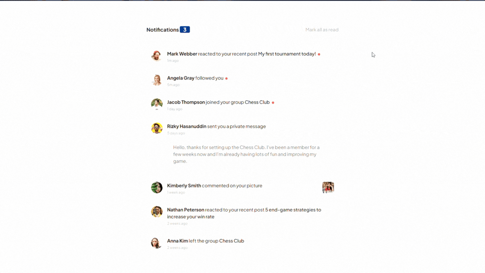
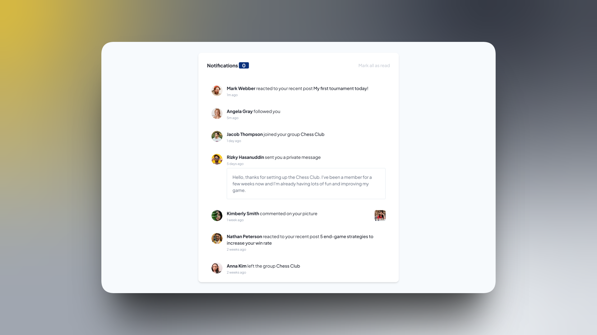

# Frontend Mentor - Notifications page solution

This is a solution to the [Notifications page challenge on Frontend Mentor](https://www.frontendmentor.io/challenges/notifications-page-DqK5QAmKbC). Frontend Mentor challenges help you improve your coding skills by building realistic projects.

## Table of contents

- [Overview](#overview)
  - [The challenge](#the-challenge)
  - [Screenshot](#screenshot)
  - [Links](#links)
- [My process](#my-process)
  - [Built with](#built-with)
- [Author](#author)

## Overview

### The challenge

Users should be able to:

- Distinguish between "unread" and "read" notifications
- Select "Mark all as read" to toggle the visual state of the unread notifications and set the number of unread messages to zero
- View the optimal layout for the interface depending on their device's screen size
- See hover and focus states for all interactive elements on the page

### Screenshot

💻 Desktop

### Links

- Solution URL: [https://github.com/fermop/notifications-page-nextjs](https://github.com/fermop/notifications-page-nextjs)
- Live Site URL: [https://fermop-notifications-page-nextjs.vercel.app/](https://fermop-notifications-page-nextjs.vercel.app/)

## My process

### Built with

- Semantic HTML5 markup
- CSS custom properties (Tailwind v4 Theme)
  - Flexbox
  - [Tailwind CSS](https://tailwindcss.com/) - For styling
- Mobile-first workflow
- [React](https://es.react.dev/) - JS library
- [Next.js](https://nextjs.org/) - React framework
- [TypeScript](https://www.typescriptlang.org/) - For type safety

## Author

- Frontend Mentor - [@fermop](https://www.frontendmentor.io/profile/fermop)
- Linkedin - [Fernando Pérez Mojica](https://www.linkedin.com/in/fernando-pérez-mojica-71b28a361)